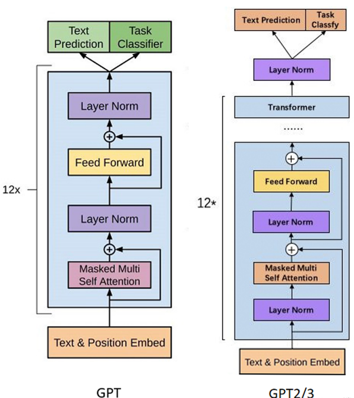
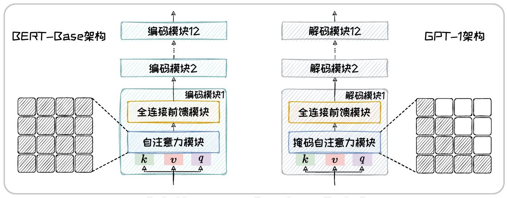
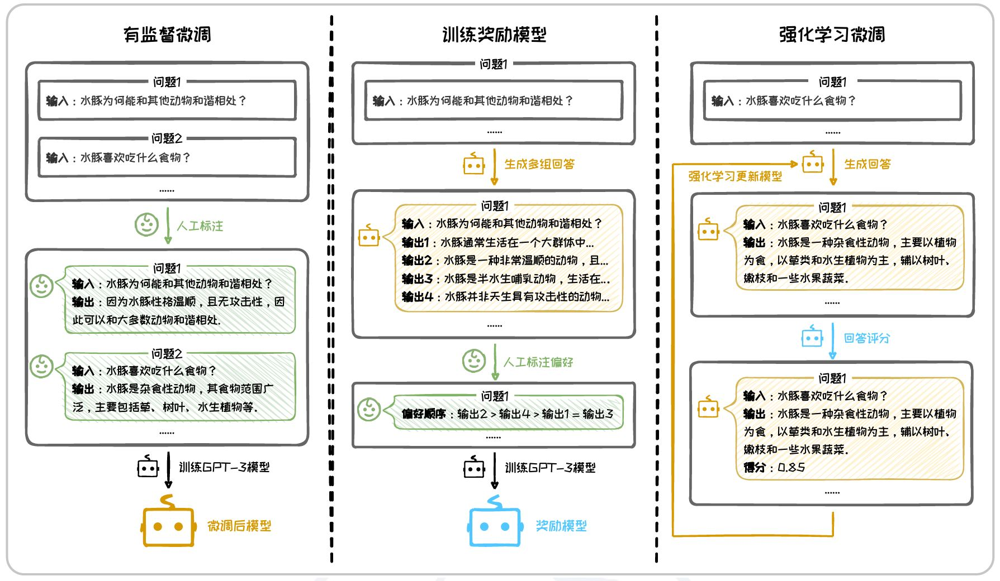

# Large Model Learning Note

## 手撕大模型

### Transformer

- Transformer 完全基于**注意力机制**，没有递归或卷积结构，所以不具备处理序列信息的能力，其通过**位置编码**处理序列。
- Transformer 是由两种模块组合构建的模块化网络结构。两种模块分别为：（1）**注意力**（Attention）模块；（2）**全连接前馈**（Fully-Connected Feedforward）模块。其中，
自注意力模块由自注意力层（Self-AttentionLayer）、残差连接（ResidualConnections）和层正则化（LayerNormalization）组成。全连接前馈模块由全连接前馈层（占总参数2/3），残差连接和层正则化组成。

- Feedforward 用于增强模型非线性能力 LayerNormalization 用以加速神经网络训练过程并取得更好的泛化性能。
- Transformer 结构示意图（以 Encoder 和 Decoder 为主）。原始的 Transformer 采用 Encoder-Decoder 架构，
其包含 Encoder 和 Decoder 两部分。这两部分都是由自注意力模块和全连接前馈模块重复连接构建而成。
其中，**Encoder 部分由六个级联的 encoder layer 组成，每个 encoder layer 包含一个注意力模块和一个全连接前馈模块**。
其中的注意力模块为自注意力模块（query，key，value 的输入是相同的）。** Decoder 部分由六个级联的
decoder layer 组成，每个 decoder layer 包含两个注意力模块和一个全连接前馈模块**。
其中，**第一个注意力模块为自注意力模块，第二个注意力模块为交叉注意力模块**
（query，key，value 的输入不同）。Decoder 中第一个 decoder layer 的自注意力模块的输入模型的输出。其后的decoder layer的自注意力模块的输入为上一个 decoder
layer 的输出。Decoder 交叉注意力模块的输入分别是自注意力模块的输出（query）和最后一个 encoder layer 的输出（key，value）。
- [Code](../Code/Transformer.py)中 class 调用结构示意图。
- **优缺点：** 相较于 RNN 模型串行的循环迭代模式，Transformer 并行输入的特性，使其容易进行并行计算。但是，Transformer 并行输入的范式也导致网络模型的规模随输入序列长度的增长而平方次增长。这为应用 Transformer 处理长序列带来挑战。
---

### GPT
- GPT系列结构差异
- GPT于Transformer相比，只使用Decoder部分，并进行LayerNorm前置（GPT-2/3）。

#### GPT-1
- GPT-1：使用Transformer中的Decoder部分，省略Encoder部分和交叉注意力模块。
- GPT-1在结构上与BERT-Base高度类似，如图所示。本质区别在于后者的自注意力模块是双向的自主机制，GPT-1中的是**带掩码的单向自注意力机制**。

- 预训练方法：采用**下一词预测任务**，可以在不需要人为构造大量带标签数据前提下，学习大量语言常识。之后再进行有监督微调

#### GPT-2
- GPT-2：延续GPT-1架构，只是**进一步加大了参数量**。
- 预训练方法：继续采用**下一词预测任务**，但进一步提升预训练数据的数量和质量。 
- 相比GPT-1，GPT-2在某些任务上可以直接进行**零样本学习**。

#### GPT-3
- GPT-3：延续并拓展前两代架构，显著增加解码块的数量、隐藏层的维度和自注意力头的数量。
- 预训练方法：继续采用**下一词预测任务**。
- GPT-3具有良好的上下文学习能力，可以在无需微调情况下，仅通过在输入文本中明确任务描述和提供少量示例，执行多种下游任务。

#### InstructGPT
- 采用**用户偏好对齐**（User Intent Alignment），通过引入**人类反馈强化学习**（Reinforcement Learning from Human Feedback, RLHF），显著提升模型对用户指令的响应能力。
- 人类反馈强化学习。
- RLHF的计算成本太高，因为（1）**奖励模型**的训练过程复杂且耗时。（2）除了需要单独训练语言模型和奖励模型外，还需要协调这两模型进行**多模型联合训练**。
- **直接偏好优化**（Direct Preference Optimization, DPO）是为了克服RLHF在计算效率上的缺陷。DPO直接利用人类偏好数据训练模型，省略奖励模型和强化学习步骤。在处理复杂的人类偏好时可能略逊于RLHF，但其**计算效率更高**。

#### ChatGPT和GPT-4
- 闭源，无需本地部署，标志着新的服务模式LLMaaS（LLM as a Service）出现。

---

### LLaMa

---

### DeepSeek
https://zhuanlan.zhihu.com/p/14953285242（论文解析）

**整体架构**：MLA + DeepSeekMoE + MTP

**训练架构**：精细化分块量化 + 提升乘累精度 + 在线量化” 的 FP8 

- **专家混合**（Mixture-of-Experts, MoE）架构自然语言生成模型

- **多头潜在注意力**（Multi-head Latent Attention, MLA）机制和**DeepSeekMoE架构**
  
- **多token预测** （Multi-token Prediction，MTP）

---

### LLM、VLM基本框架

- Encoder-Only: BERT; Encoder-Decoder: T5; Decoder-Only: GPT-3; 非Transformer结构（需要一个思维导图）
- Decoder-Only: 开放式（Open-Ended）生成任务，无明确输入，不需要完整编码器。模型**更加轻量化**，**加快了训练和推理速度**。
---

## 微调技术 PEFT

### LoRA

---

### P-Tuning

---

## 知识检索增强

--- 

### RAG

---

### 向量数据库

---

### agent

---

### embedding

---

## 大模型工具

### DevOps工具

---

###  langchain

---
